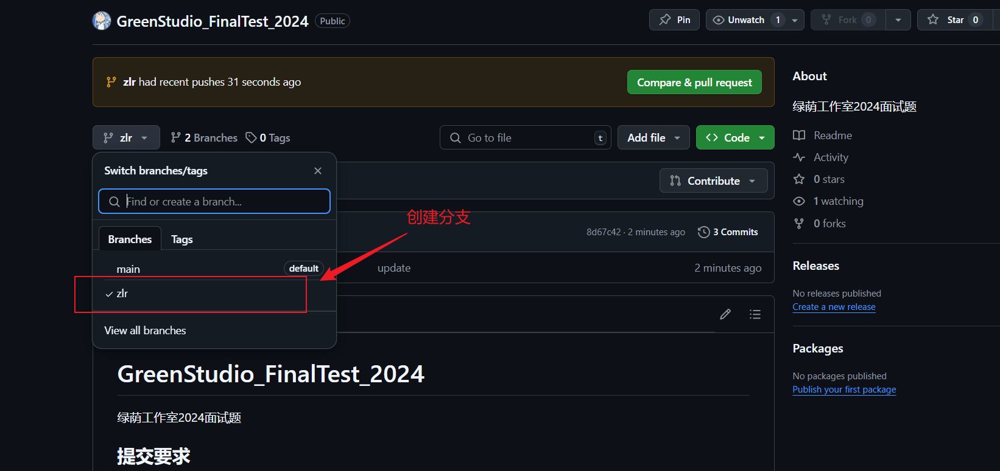
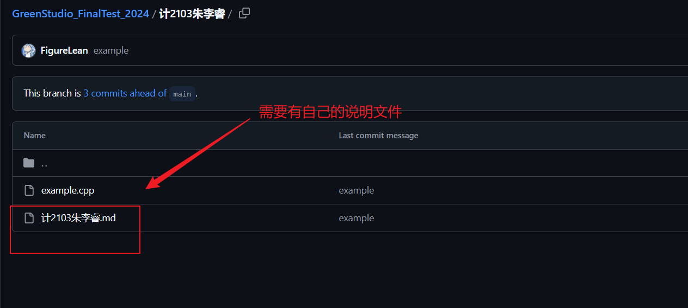

# GreenStudio_FinalTest_2024

绿荫工作室2024面试题

## 提交要求

1. 请在提交时创建对应的分支，并提交到对应的分支下
2. 分支命名为自己名字的缩写，比如 朱李睿缩写为 zlr
3. 需要有一个 `md`格式的说明文件，文件命名为 `班级＋姓名`。例如 `计2103朱李睿`
4. 面试题在FinalTest文件中

## 注意事项：

1. 正确的上传作品也算考核的一道题
2. 可以借鉴网络，但是不要抄袭，雷同直接pass，不要问学长学姐（说不定他们也不会）

## 参考样例

1. 创建自己的分支
   
2. 需要有自己的说明文件

   
